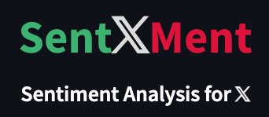
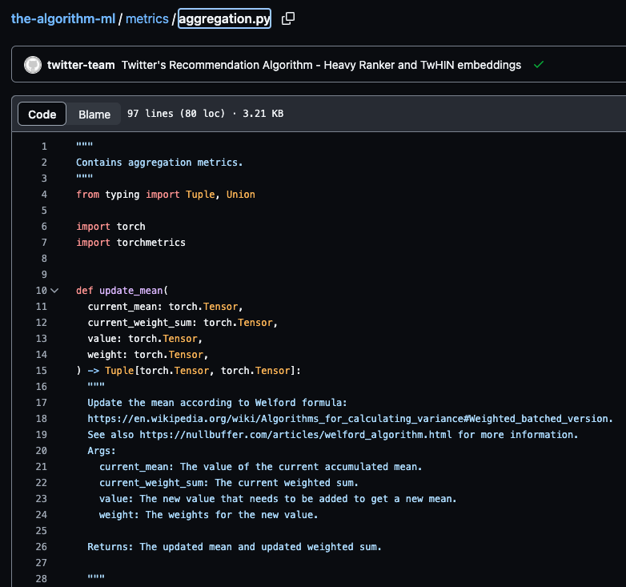
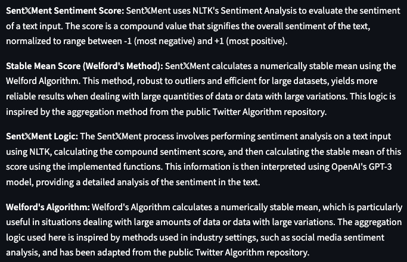
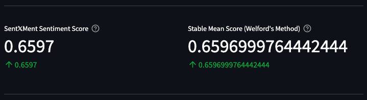

# Sent𝕏Ment: Advanced Sentiment Analysis Tool

<p align="center">
  
</p>

Sent𝕏Ment is an sentiment analysis application that is specifically designed to provide deeper insights into the sentiment present in textual data. This advanced tool goes beyond traditional keyword-based sentiment analysis and leverages the power of Natural Language Processing (NLP), Machine Learning (ML), and Artificial Intelligence (AI) to interpret the sentiment, context, and nuances within the text.

The tool's key strength lies in its integration with OpenAI GPT-3.5 Turbo & GPT-4 API. By integrating with Large Language Models and sentiment algorithms, Sent𝕏Ment is able to provide highly accurate sentiment analysis that takes into account the complexities and subtleties of all human language.

In terms of its NLP capabilities, Sent𝕏Ment employs various techniques such as tokenization, part-of-speech tagging, and named entity recognition. This allows the tool to break down the text into smaller components, identify the grammatical role of each word, and recognize important entities, all of which contribute to a more accurate analysis of sentiment.

On the machine learning front, Sent𝕏Ment makes use of advanced models that are trained on large datasets. These models are capable of recognizing patterns in the text and predicting sentiment based on these patterns. The application of machine learning enables Sent𝕏Ment to handle large volumes of text and provide real-time sentiment analysis.

Overall, Sent𝕏Ment is a comprehensive tool for sentiment analysis that is capable of handling a wide range of texts, from short social media posts to lengthy documents. With its sophisticated techniques and advanced integration, it pushes the boundaries of what is possible in the field of sentiment analysis.


## Twitter Aggregation Algorithm

Sent𝕏Ment's Twitter Aggregation Algorithm is a sophisticated algorithm that is capable of aggregating tweets from a specific user and analyzing the sentiment of the aggregated tweets. This algorithm is designed to provide a more accurate analysis of sentiment by taking into account the context and nuances of the tweets. We use the same logic as the public Twitter Algorithm, but we have added a few additional features to make it more accurate. We preserve the use of the Welford formula, more details can be found in the [Wikipedia article](https://en.wikipedia.org/wiki/Algorithms_for_calculating_variance#Weighted_batched_version).

For further information, check out this article on the [Welford Algorithm](https://nullbuffer.com/articles/welford_algorithm.html).


<p align="center">
  
</p>


## Table of Contents

1. [Features](#features)
2. [Getting Started](#getting-started)
   - [Prerequisites](#prerequisites)
   - [Installation](#installation)
3. [Usage](#usage)
4. [Contributing](#contributing)
5. [License](#license)
6. [Contact](#contact)

---

**Sent𝕏Ment** employs NLTK's SentimentIntensityAnalyzer to compute sentiment scores, ranging from -1 (negative) to +1 (positive). It harnesses the Welford algorithm to calculate a stable mean of sentiment scores, and interprets these scores using OpenAI's GPT-3.5 Turbo model.

<p align="center">
  
</p>

**Pre-Trained**:
- Advanced sentiment analysis models
- Natural Language Processing techniques
- Machine Learning models

**Output**:
- Detailed sentiment scores
- Comprehensive interpretation of sentiment
- Stable mean of sentiment scores

---

## Sent𝕏Ment Feature Overview

Sent𝕏Ment provides an exhaustive analysis of sentiment in textual data. The application's features are meticulously crafted to deliver a detailed breakdown of sentiment, thus facilitating in-depth understanding of textual data.

<p align="center">
  
</p>

### Features

- **Sentiment Score Calculation**: Calculates sentiment scores for textual data, ranging from -1 (negative) to +1 (positive).
- **Sentiment Analysis**: Employs the Welford algorithm for computing a stable mean of sentiment scores, ensuring refined analysis.
- **Sentiment Interpretation**: Utilizes OpenAI's GPT-3.5 Turbo model to interpret sentiment scores, offering a comprehensive breakdown of sentiment within the text.

---

## Getting Started

### Prerequisites
- Python 3.10+
- Streamlit 1.25.0+
- NLTK 3.6.5+
- pip

### Installation
1. Clone the repo:

```bash
   git clone https://github.com/AdieLaine/SentXMent.git
```

2. Navigate to the SentXMent directory:

Directory Structure:

```bash
SentXMent/
├── requirements.txt
├── images/
│   ├── logo.png
│   └── agg.png
│   └── overview.png
│   └── overview2.png
├── src/
│   ├── sent_x_ment.py
├── LICENSE
└── README.md
```

```bash
   cd SentXMent
```

3. Install Python packages:

```bash
   pip install -r requirements.txt
```

4. Download the required NLTK data:

```bash
   python -m nltk.downloader vader_lexicon
```

5. Run the Streamlit app:

```bash
   streamlit run src/sent_x_ment.py
```

6. Open the app in your browser:

```bash
   http://localhost:8501/
```